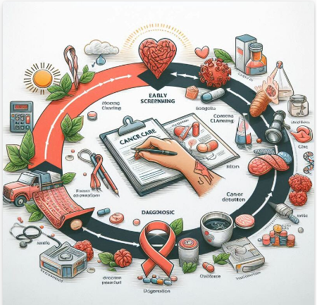

    # Cancer Care Timeline 
    ## Analyzing each patients temporal pathway through their cancer treatment and survivorship.
    
## Solution Overview: 

**Survival time analysis**, also known as survival analysis or time-to-event analysis, is a statistical method used to analyze the time until an event of interest occurs, such as death, disease recurrence, or treatment failure. In healthcare, survival time analysis is a valuable tool for understanding the prognosis of patients, evaluating the effectiveness of treatments, and identifying factors that influence patient outcomes. By accounting for censored data and modeling time-dependent variables, survival time analysis provides insights into the natural history of diseases, aiding clinicians in making informed decisions about patient care and treatment strategies.

## De Novo - From the beginning

The Latin term **"de novo"** means **"from the beginning"** or "anew." In the context of epidemiology, "de novo" is often used to describe the emergence of a disease or condition that appears for the first time in a population, without any prior occurrence or known precursor. It implies that the condition has developed anew rather than from an existing condition or source.

For example, a "de novo" mutation refers to a new genetic mutation that arises spontaneously rather than being inherited from a parent. Similarly, a "de novo" case of a disease might refer to the first occurrence of that disease in a specific population or individual, indicating it is not a recurrence or continuation of a previous outbreak or condition.

 ## Cancer Treatment Timelines 
 1. **T1** - De novo Cancer Diagnosis 
  2. **T2** - Time from T1 to Pathology 
  3. **T3** - Time from T1 to Biopsy 
  4. **T4** - Time from T1 to Cancer Screening 
  5. **T5** - Time from T1 to Genomic Assay 
  6. **T6** - Time from T1 to Oncology Referral 
  7. **T7** - Time from T1 to Care Plan 
  8. **T8** - Time from T1 to First Line Modality Treatment 
  9. **T9** - Time from T1 to First Therapeutic Response 
  10. **T10** - Time from T1 to Second Modality Treatment 
  11. **T11** - Time from T1 to First Therapeutic Switch 
  12. **T12** - Time from T1 to Remission 
  13. **T13** - Time from T1 to Cure 
  14. **T14** - Time from T1 to Death 
  15. **T15** - Time from T1 to Palliation / Hospice 
  16. **T16** - Time from T1 to Active Surveillance / Maintenance 
  17. **T17** - Time from T1 to Neo - Adjuvant Treatment 
  18. **T18** - Time from T1 to Adjuvant Treatment 
  19. **T19** - Time from T1 to Inpatient Hospitalization 
  20. **T20** - Time from T1 to ED / Urgent Care Event 
  

## Getting Started

The goal of this solution is to **Jump Start** your development and have you up and running in 30 minutes. 

To get started with the **Cancer Care Timeline** solution repository, follow these steps:
1. Clone the repository to your local machine.
2. Install the required dependencies listed at the top of the notebook.
3. Explore the example code provided in the repository and experiment.
4. Run the notebook and make it your own - **EASY !**
    ## Getting Started
## Solution Features

- Easy to understand and use  
- Easily Configurable 
- Quickly start your project with pre-built templates
- Its Fast and Automated
- Saves You Time 

## Notebook Features

These Features are design to provide everything you need for **Knowledge Transfer** 

- **Self Documenting** - Automatically identifes major steps in notebook 
- **Self Testing** - Unit Testing for each function
- **Easily Configurable** - Easily modify with **config.INI** - keyname value pairs
- **Includes Talking Code** - The code explains itself 
- **Self Logging** - Enhanced python standard logging   
- **Self Debugging** - Enhanced python standard debugging
- **Low Code** - or - No Code  - Most solutions are under 50 lines of code
- **Educational** - Includes educational dialogue and background material
    
## List of Figures
       
    

## Github https://github.com/JoeEberle/ - Email  josepheberle@outlook.com 
    

    